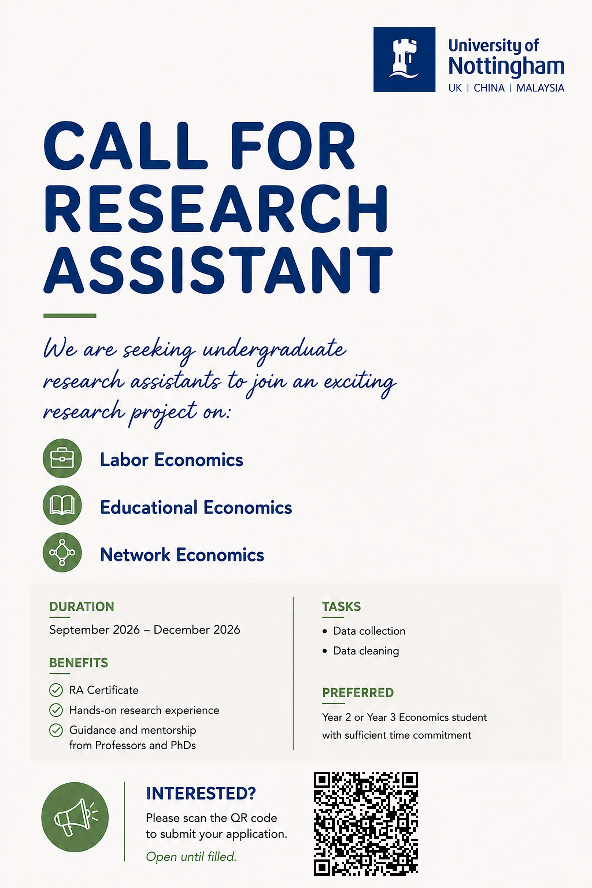

We are recruiting undergraduate Research Assistants (RAs) to support research projects in Labor Economics, Educational Economics, and Network Economics. The project will run from September to December 2026, and the main RA responsibilities will involve data collection and data cleaning.

As the project requires continuous collaboration over the semester, regular and reliable time commitment throughout the project period is particularly important to us. Before applying, please consider your academic schedule and any other commitments that may affect your availability between September and December 2026.

Shortlisted applicants may be invited to a brief interview.

We greatly appreciate your interest in our research and look forward to learning more about you.

